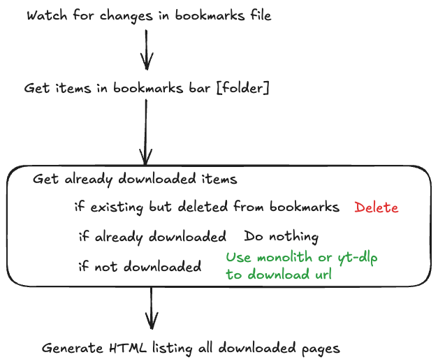

# Offline-bookmarks

This tool automatically downloads all bookmarks from your bookmarks bar folder (Chrome only) as html.

Requires [monolith](https://github.com/Y2Z/monolith) and [Bun](https://bun.sh/) to run.

To run:

```bash
INPUT_BOOKMARKS_FILE="~/Library/Application Support/Google/Chrome/Default/Bookmarks" bun start
```

# Environment Variables
```sh
INPUT_BOOKMARKS_FILE # Input bookmarks json e.g. Chrome bookmarks file (default: ./bookmarks.json)
OUTPUT_FOLDER # Output folder for downloaded pages (default: ./offline)
BOOKMARKS_FOLDER_NAME # Name of the bookmarks folder in the bookmarks bar (default: "offline")
```

The `OUTPUT_FOLDER` can be shared with tools like [syncthing](https://syncthing.net/) to syncronize the downloaded pages across devices, deleting bookmarks on another Chrome browser will delete the pages in the output folder.

On Android the offline folder can be served like [RoundSync](https://roundsync.com/).

Developer diagram.


